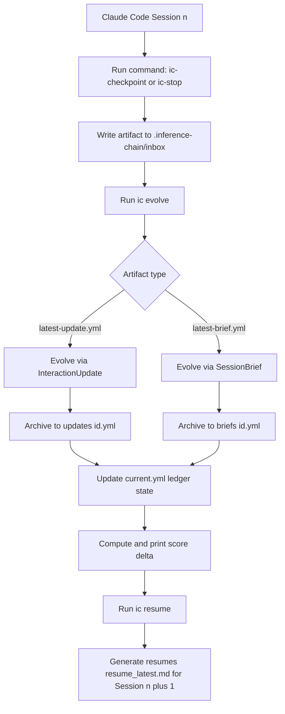

# Inference Chain — A Forward Inference Ledger for Claude Code

Inference Chain is a local-first agentic context engineering layer for Claude Code.

## What it is
A forward-only n+1 inference ledger that evolves session context.

## What it is not
Not RAG, not transcript archive, not vector DB, not blockchain.

## Architecture flow (Claude Code + Inference Chain)



## Quickstart
```bash
pnpm install
pnpm build
pnpm link --global
ic init --project-name "My Project"
ic install-claude
```

## Commands
`ic init`, `ic install-claude`, `ic ingest`, `ic evolve`, `ic resume`, `ic status`, `ic verify`, `ic health`, `ic doctor`, `ic theme`, `ic goal`

## Local n+1 algorithm test (on this machine)
1. Install dependencies:
   `pnpm install`
2. Run tests (includes a mathematical n+1 progression test):
   `pnpm test`
3. Run only progression test:
   `pnpm test -- evolveMath.test.ts`
4. Manual CLI flow:
   - `pnpm build`
   - `node dist/cli.js init --project-name "Demo"`
   - Create `.inference-chain/inbox/latest-update.yml` (InteractionUpdate)
   - `node dist/cli.js evolve`
   - Create `.inference-chain/inbox/latest-brief.yml` (SessionBrief)
   - `node dist/cli.js evolve`
   - `node dist/cli.js resume`

Expected signal of progress: `ic evolve` prints a score transition like `score: 3 -> 6`; this score is computed from accumulated stable learnings, hypotheses/frontier, and do-not-repeat memory, so non-decreasing values indicate n+1 context accumulation.

## Behavior notes
- Inbox automation: `ic evolve` consumes `inbox/latest-update.yml` or `inbox/latest-brief.yml` and archives the processed file into `.inference-chain/updates/` or `.inference-chain/briefs/` automatically.

## Tooling and docs alignment notes
- Runtime requirement in project: Node.js 20+ (current CLI dependencies are compatible with modern Node LTS).
- Key toolchain in this repo: Commander, Zod, YAML, better-sqlite3, Vitest, Biome.
- Verified current guidance references:
  - Claude Code hooks docs: https://code.claude.com/docs/en/hooks
  - Commander package docs: https://www.npmjs.com/package/commander
  - Vitest docs: https://vitest.dev/
  - Biome docs: https://biomejs.dev/
  - Zod package/docs: https://www.npmjs.com/package/zod

## License
Apache-2.0


## Plugin and automation enhancements
- `ic init` now auto-detects project name from current working directory when `--project-name` is omitted.
- Claude detection is automatic: if `.claude` already exists, `ic install-claude` skips by default (use `--force` to overwrite).
- New `ic goal` command stores a goal and optional `max_iterations`; `ic evolve` stops automatic loops when the cap is reached.
- New `ic health` command reports context/system health checks.
- New `ic doctor` command prints troubleshooting context and guided next steps.
- New `ic theme --oh-my-posh` writes an integration snippet for prompt/status integration.
