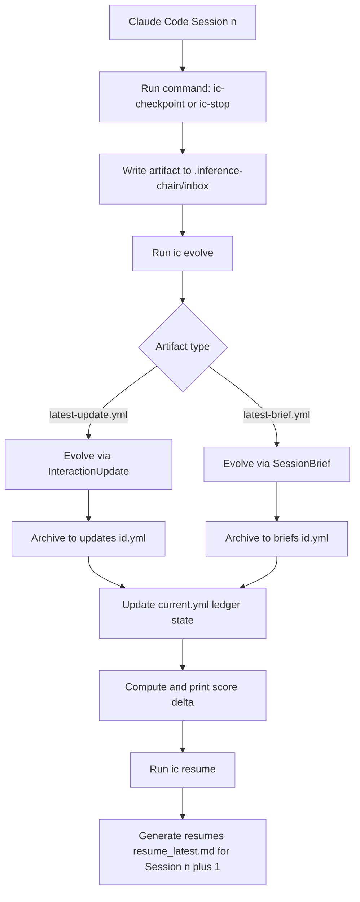

# Inference Chain — A Forward Inference Ledger for Claude Code

> Every Claude Code session continues sharper than the last.

Inference Chain is a **local-first agentic context engineering layer for
Claude Code**. It turns isolated coding sessions into a forward-moving
inference chain by capturing session handoffs, evolving the operating
context after meaningful interactions, and generating sharper resume briefs
for the next session.

It is **not** RAG, not a vector DB, not a transcript archive, not
blockchain, not a SaaS, and not a Claude Code replacement.

It answers: *where did the last agent leave the work, what is the latest
operating theory, and what should the next agent do without repeating failed
paths?*

Full spec: [docs/PRD-TRD.md](docs/PRD-TRD.md).

## Why
Claude Code is powerful within a session but weak across sessions. When
context compacts, resets, or gets copied into a new chat, the agent loses
continuity. Inference Chain maintains a **forward-only n+1 inference ledger**
that evolves with each session:

```text
Ledger n + Session Brief n + Interaction Updates n  =  Ledger n+1
```

## The n+1 loop
```text
Session n
  → Session Brief n
  → Memory Evolution Record n
  → Chain Ledger n+1
  → Resume Brief n+1
  → Session n+1 starts sharper
```

## Architecture flow (Claude Code + Inference Chain)


```mermaid
flowchart TD
  A["Claude Code Session n"] --> B["Run command: ic-checkpoint or ic-stop"]
  B --> C["Write artifact to .inference-chain/inbox"]
  C --> D["Run ic evolve"]
  D --> E{"Artifact type"}
  E -->|"latest-update.yml"| F["Evolve via InteractionUpdate"]
  E -->|"latest-brief.yml"| G["Evolve via SessionBrief"]
  F --> H["Archive to updates id.yml"]
  G --> I["Archive to briefs id.yml"]
  H --> J["Update current.yml ledger state"]
  I --> J
  J --> K["Compute and print score delta"]
  K --> L["Run ic resume"]
  L --> M["Generate resumes resume_latest.md for Session n plus 1"]
```

## Quickstart

Requires **Node.js ≥ 20** and **pnpm**.

```bash
pnpm install
pnpm build
pnpm link --global

cd /path/to/your/project
ic init --project-name "My Project"
ic install --target claude   # or: --all | --detect | --target cursor,vscode
# alias: ic install-claude
```

`ic install --target claude` will:
1. Write slash commands to `.claude/commands/ic-*.md` from
   `templates/common/commands/` (skips existing files unless `--overwrite`).
2. Merge `SessionStart` / `PreCompact` / `Stop` hooks into
   `.claude/settings.json` without clobbering your existing settings.
3. Drop a Claude Code Plugin scaffold into
   `.claude/plugins/inference-chain/` with full command bodies.
4. Merge project MCP into `.mcp.json` (Claude Code project scope; not settings.json).

Other targets install the equivalent host pack (commands, hooks, skills,
`AGENTS.md`, and project MCP for `ic mcp`). See [docs/agents.md](docs/agents.md).

Project MCP config is written as plain `ic mcp` so it can be committed and used
by the whole team, which means the CLI has to be on PATH. If you'd rather pin
this machine's node binary and CLI path, install with `--pin-launch` and keep
the result out of version control.

Re-init is refused unless you pass `--force` (wipes `.inference-chain/`):

```bash
ic init --project-name "My Project" --force
```

## Daily use

**Mid-session checkpoint (interaction-level evolution):**

In Claude Code:
```text
/ic-checkpoint
```

In your terminal:
```bash
ic ingest .inference-chain/inbox/latest-update.yml
ic evolve
```

**End of session (session-level handoff):**

In Claude Code:
```text
/ic-stop
```

In your terminal:
```bash
ic ingest .inference-chain/inbox/latest-brief.yml
ic evolve
ic resume
```

**Resume next time** — `/ic-resume` reads
`.inference-chain/resumes/resume_latest.md` and continues from the current
frontier without rediscovering rejected hypotheses.

## Commands
| Command                         | What it does                                              |
| ------------------------------- | --------------------------------------------------------- |
| `ic init --project-name`        | Initialize `.inference-chain/`, SQLite, JSONL, templates  |
| `ic init --force`               | Wipe an existing project and re-initialize                |
| `ic install --target\|--all\|--detect` | Install host adapter(s) (see `docs/agents.md`) |
| `ic install-claude`             | Alias for `ic install --target claude` |
| `ic ingest <file>`              | Validate + store an artifact (routes by `kind`; idempotent on id) |
| `ic evolve [--advance]`         | Apply latest brief/update under the ledger lock           |
| `ic resume [--silent]`          | Generate `resumes/resume_latest.md`                        |
| `ic status`                     | Show iteration, event count, ledger sizes, score          |
| `ic doctor [--json] [--strict]` | Check init, ledger, hosts, and adapter wiring             |
| `ic verify`                     | Replay hash chain; SQLite parity; `current.yml` tip check |
| `ic mcp [--cwd <dir>]`          | Start an MCP stdio server for Claude Desktop              |
| `ic simulate <dir>`             | Replay session artifacts and print n+1 sharpness metrics  |
| `ic teams init`                 | Scaffold `.inference/` + Husky hook + bot-distill Action  |
| `ic teams merge <dir>`          | Deterministic multi-dev ledger merge (`--out/--resume/--strict`) |
| `ic teams validate <file>`      | Schema-check a `dev_<name>.yml` ledger                    |
| `ic teams sync <dir>`           | Validate all, merge, write team ledger, print resume      |

## Claude Desktop (MCP)
Add an entry to your `claude_desktop_config.json`:

```json
{
  "mcpServers": {
    "inference-chain": {
      "command": "ic",
      "args": ["mcp", "--cwd", "/abs/path/to/your/project"]
    }
  }
}
```

Tools exposed: `chain_status`, `chain_resume_brief`, `chain_ingest_update`,
`chain_ingest_brief`, `chain_ingest_evolution`, `chain_evolve`, `chain_verify`.
The MCP server
resolves `.inference-chain/` from `--cwd`, so multiple Desktop projects can
each have their own ledger — as long as each session starts in the same
folder, the ledger is the key.

`chain_evolve` returns `source` as `session` | `interaction` (plus
`record_source` for the evolution-record enum). `chain_verify` keeps `ok`
as hash-chain health; use `overall_ok` (and `in_sync` / `current_yml_ok`)
for full integrity.

## Teams (shared repo)

Two ways to share context across a team, both via `ic teams`:

- **Deterministic merge (recommended core):** each developer keeps a
  `dev_<name>.yml` `ChainLedger`; `ic teams merge ./ledgers --out team-ledger.yml
  --resume` unions them into one team ledger with no model call — reproducible
  and `ic verify`-friendly. `--strict` exits non-zero on conflicts for CI.
  Ledgers must share the same `project_id` or merge fails.
- **LLM synthesis (opt-in):** `ic teams init` scaffolds an `.inference/`
  masterplan, a Husky pre-commit hook that distills developer ledgers via
  Claude, and a GitHub Action that distills PR review-bot feedback into a
  **reviewable PR** (never a direct push of LLM output to the default branch).
  This path uses model API calls and is isolated from the deterministic solo
  core. Treat merges that touch `.inference/scripts/**` or the bot-distill
  workflow as secret-equivalent (CODEOWNERS recommended).

See `docs/teams.md`, the bake-off in `docs/teams-comparison.md`, and the
`distill` front-end design in `docs/teams-distill-scope.md`.

## Validate the n+1 hypothesis (evals)

```bash
cd /tmp && mkdir ic-demo && cd ic-demo
ic simulate /path/to/inference-chain/examples/demo-project/build-task-api/sessions \
  --reset --project-name "task-api"
```

Prints per-step deltas (stable+, rejected+, do-not-repeat+, frontier) and a
final report with six metrics. A scenario is **n+1-positive** when
`anti_repeat_coverage ≥ 0.5`, `rejected_persistence = 0`, and
`score_progression > 0`. See `docs/PRD-TRD.md` §22 for metric definitions.

### Latest eval snapshot (`build-task-api`, 8 steps)

| Metric | Result | Gate |
| --- | --- | --- |
| `anti_repeat_coverage` | **0.75** | ≥ 0.5 ✓ |
| `rejected_persistence` | **0** | = 0 ✓ |
| `score_progression` | **+5.667 / iter** | > 0 ✓ |
| `hypothesis_promotion_rate` | 1.0 | — |
| `frontier_convergence` | 1.0 | focused |
| `final_brief_size_kb` | 1.96 | under 8 ✓ |

**Verdict: n+1 POSITIVE** — ledger carried useful signal forward.

Score path: `0 → 3 → 4 → 6 → 6 → 5 → 10 → 17` over 3 iterations.
`ic verify` after the run: hash chain valid, SQLite in sync, `current.yml`
matches the last `ledger_evolved` tip.

Ablations (same scenario):

| Config | Verdict | Note |
| --- | --- | --- |
| Default `IC_STABLE_THRESHOLD=2` | n+1 POSITIVE | baseline |
| `IC_STABLE_THRESHOLD=1` | n+1 POSITIVE | promotes earlier when evidence allows |
| `IC_STABLE_THRESHOLD=3` | n+1 POSITIVE | promotion delayed to second explicit confirm |
| `IC_RESUME_TOP_K=3` | n+1 POSITIVE | smaller brief, same gates |

Team merge synthetic eval (2 developers, one assert/deny conflict): conflict
quarantined into an open question; `--strict` exits non-zero; divergent
`project_id` values are rejected. Exclusive-belief e2e: promote then reject
removes the item from stable and keeps it only under rejected.

Unit/integration suite: **69 tests** green after the CodeFerret hardening pass.

## How the ledger stays sharp

Evolution is deterministic (not a model call). A few rules keep the resume
brief coherent:

- **Exclusive belief sections.** A belief lives in at most one of
  active / stable / rejected. Reject demotes stable knowledge; re-confirm
  clears a prior rejection.
- **Promote.** Confirmations accumulate; at `IC_STABLE_THRESHOLD` the
  hypothesis graduates to `stable_learnings`.
- **Prune resolved blockers.** Rejecting a belief drops any matching
  frontier blocker so solved problems stop resurfacing.
- **Converge the frontier.** Non-empty `next_action_delta` / session
  `next_best_action` *replace* the frontier rather than append forever.

## Tuning (environment variables)
- `IC_STABLE_THRESHOLD` (default `2`) — how many supporting-evidence items
  promote an active hypothesis to `stable_learnings`.
- `IC_RESUME_TOP_K` (default `12`) — cap on items per section in the
  resume brief (full ledger always lives in `current.yml`).

## What gets stored
```text
.inference-chain/
  chain.db                # SQLite (events, briefs, updates, evolutions, chain_state)
  ledger.jsonl            # Append-only hash-chained event log
  current.yml             # Current ChainLedger (the operating model)
  project.yml             # Project metadata
  inbox/                  # Drop new YAML artifacts here
  briefs/ updates/ evolutions/ resumes/ prompts/ locks/
```

## Integrity guarantees

- **Hash chain.** Each ledger event includes `parentEventId` + `parentHash`,
  and a `hash` of `sha256(canonicalJson(event-without-hash))`. `ic verify`
  recomputes the chain and exits non-zero on any tamper or broken link.
- **Locked evolve path.** `ic evolve` (CLI + MCP) holds a re-entrant
  cross-process lock across load → resolve inbox → capture → commit →
  archive. MCP inbox writes and capture share that lock so ingest cannot
  swap the inbox mid-evolve. Stale locks are broken only after a dead-PID
  check via atomic rename (no TOCTOU dual-hold).
- **Source-id idempotent evolve.** If a crash leaves the inbox after a
  successful commit, the next `ic evolve` archives the leftover file and
  refuses to re-apply the same source id.
- **Atomic evolve.** Evolution record + chain state + events are written in
  one SQLite transaction; JSONL is batch-appended only after commit.
  `current.yml` is written via temp-file + rename.
- **Content-parity verify.** `ic verify` checks JSONL↔SQLite event hashes
  (not just counts) and that `current.yml` matches the last real
  `ledger_evolved` tip (snapshot ingest events are ignored for that check).
- **Canonical JSON.** Hashes use code-unit key ordering (locale-independent).
- **Append-only.** `evolve` never rewrites prior events. The only way to
  remove history is to delete `.inference-chain/` (or `ic init --force`).
- **Idempotent capture.** Re-ingesting the same artifact id does not append
  a duplicate `*_captured` event (documented on the MCP ingest tools too).
- **Absolute paths.** CLI args like `/tmp/ledgers` resolve correctly (via
  `path.resolve`, not `path.join` against cwd).
- **Team merge exclusivity.** Deterministic merge keeps beliefs exclusive
  across active / stable / rejected (stable wins) and stamps `updated_at`
  from inputs so identical merges are byte-identical.

## Privacy
**100% local.** Nothing leaves your machine. No telemetry. No model API
calls in the solo core. The entire workflow runs against your filesystem.
(The opt-in teams LLM engines are separate and require an explicit
`ANTHROPIC_API_KEY`.)

## What we deliberately do not build
Per PRD §7: blockchain, vector search, cloud sync, dashboards, transcript
archive, code-diff tracking, AST indexing, telemetry. (An MCP stdio server
*is* shipped in v0.2 — `ic mcp` — but only as a thin adapter over the same
local artifacts; there is still no network surface on the solo core.) If a
proposed feature fits one of those, it does not belong here.

## Development
```bash
pnpm test       # 69 tests: evolve math, hash chain, verify, lock, teams, bootstrap, inbox
pnpm build
pnpm lint
pnpm format
```

See [CLAUDE.md](CLAUDE.md) for the contributor / agent guide and the
invariants that must not be broken.

## License
Apache-2.0
